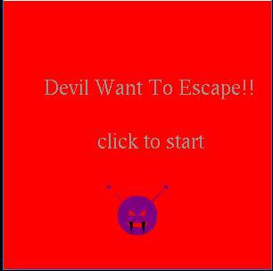
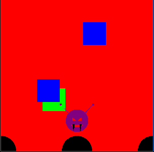
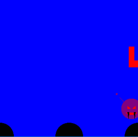
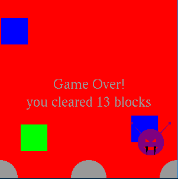
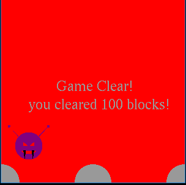
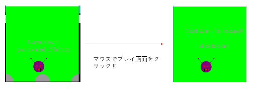

# escape_game
大学の1，2年生の時に，C言語について学習した．
その集大成として期末課題でゲームを作成する必要があり，私はブロックを回避するゲームを作成しました．

## 遊び方
ゲームを開始すると次のようにタイトル画面が表示される．この画面内をマウスでクリックすることでゲームが開始される．

悪魔さんの操作はキーボードの矢印キーの右と左で行える．右の矢印を押すと右に移動し左の矢印を押すと左に移動する．

落ちてくるブロックの種類は赤，青，緑の３種類で背景の色と同化して見えなくなっているブロックが存在している．そのため，画面の下に表示されている円をマウスでクリックすることで背景の色を変えて落ちてくるブロックを探す必要がある．左の円をクリックすると背景が青になり，赤と緑のブロックが見えるようになり，真ん中の円をクリックすると背景が赤になり，青と緑のブロックが見えるようになり，右の円をクリックすると背景が緑になり，赤と青のブロックが見えるようなる．

ブロックに５回以上当たってしまうとゲームオーバー画面が表示され，それまでに回避したブロック数が表示される．

ブロックを100回以上回避すると，ゲームクリア画面が表示される．

ゲームクリア画面，ゲームオーバー画面をもう一度マウスでクリックするとタイトル画面に戻る．タイトル画面をクリックすることでもう一度プレイすることができる．

